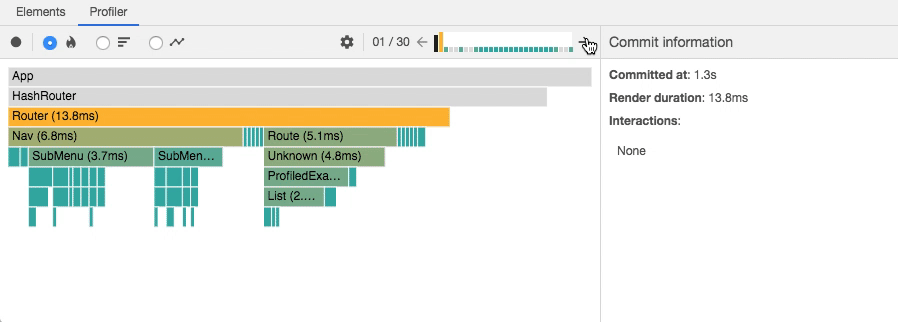

# zerrtech-boise-frontend-devs-2018

## Technology Trends

JavaScript is at the top of several lists of the most popular technologies.  No surprise there.  Owns the front end, big presence on the backend, too.

Stack Overflow 2018 Developer Survey, for programming languages, JS on top for the 6th straight year


Source: [Stack Overflow 2018 Developer Survey - Languages](https://insights.stackoverflow.com/survey/2018/#technology-programming-scripting-and-markup-languages)

Octoverse says roughly the same thing


Source: [Octoverse - Top Languages](https://octoverse.github.com/projects#languages)

Frameworks, Libraries, and Tools, Angular topping React


Source: [Stack Overflow 2018 Developer Survey - Frameworks](https://insights.stackoverflow.com/survey/2018/#technology-frameworks-libraries-and-tools)

State of JS approaches their survey in a little different way, React has a big edge on the "Used it, would use again"


Source: [State of JS 2018 - Front-end Frameworks](https://2018.stateofjs.com/front-end-frameworks/overview/)

State of JS 2018 Individual framework pages:
* [React](https://2018.stateofjs.com/front-end-frameworks/react/)
* [Vue.js](https://2018.stateofjs.com/front-end-frameworks/vuejs/)
* [Angular](https://2018.stateofjs.com/front-end-frameworks/angular/)

Most Loved Frameworks - React love


Most Dreaded Frameworks - Angular creeping up towards the top


Source: [Stack Overflow 2018 Developer Survey - Most Loved, Dreaded Frameworks](https://insights.stackoverflow.com/survey/2018/#technology-most-loved-dreaded-and-wanted-frameworks-libraries-and-tools)

VS Code somehow the most popular editor now


Source: [Stack Overflow 2018 Developer Survey - Most Popular Dev Environments](https://insights.stackoverflow.com/survey/2018/#technology-most-loved-dreaded-and-wanted-frameworks-libraries-and-tools)


## Framework Updates and New Features

### React


- React v16
  - v16.0
    - Return array of elements and strings from `render` method
    - Fragments
    ```js
    return (
      <>
        <Child0 />
        <Child1 />
        <Child2 />
      </>
    )
    // Or
    
    return (
      <React.Fragment>
        <Child0 />
        <Child1 />
        <Child2 />
      </React.Fragment>
    )
    ```
    
  - v16.3
    - Context API
      - Pass data to deeply nested components without passing props all the way down
      - Use cases:
        - Authenticated users
        - Themes
        - Preferred language
  - v16.5
    - Support for [React DevTools Profiler](https://reactjs.org/blog/2018/09/10/introducing-the-react-profiler.html)
      - View rendering performance in a variety of views: flame chart, component chart, ranked chart, etc.
      - How long a component took to render
      - How many times a component re-rendered
      - Trace interactions
      
  - v16.6
    - Suspense for code splitting
    ```js
    // This component is loaded dynamically
    const OtherComponent = React.lazy(() => import('./OtherComponent'));

    function MyComponent() {
      return (
        <React.Suspense fallback={<Spinner />}>
          <div>
            <OtherComponent />
          </div>
        </React.Suspense>
      );
    }
    ```
  - Coming soon:
    - React Hooks (~Q1 2019)
      - Allows you to write `function` components with local state and lifecycle hooks
      ```javascript
      import { useState, useEffect } from 'react';

      function Example() {
        // create state variable and setter fn
        const [count, setCount] = useState(0);

        // Similar to componentDidMount and componentDidUpdate:
        useEffect(() => {
          // Update the document title using the browser API
          document.title = `You clicked ${count} times`;
        }, [count]);

        return (
          <div>
            <p>You clicked {count} times</p>
            <button onClick={() => setCount(count + 1)}>
              Click me
            </button>
          </div>
        );
      }
      ```
    - Concurrent Mode (~Q2 2019)
    - Suspense for Data Fetching (~mid 2019)

### Vue
 
- [Vue surpassed React in Github stars](https://hasvuepassedreactyet.surge.sh/)
  - **Vue:** 124k
  - **React:** 119k
- Vue CLI 3.0 released in August ([release announcement](https://medium.com/the-vue-point/vue-cli-3-0-is-here-c42bebe28fbb]))
- Vue 3.0 announced
  - [Roadmap](https://github.com/vuejs/vue/projects/6)
  - Planned release: End of Q2 2019
  - Features
    - Compiler rewrite
    - Added TSX for improved Typescript support
    - Speed, size, and memory improvements
    - Experimental Hooks API
    - Easier debugging with improved warnings and easier to trace re-renders


### Angular

- Angular v6
  - New CLI commands
    - `ng update` - recommends dependency updates
    - `ng add` - adds new capabilites to you app like PWA or Angular Elements
  - Angular Elements
    - Register Angular components as [custom elements](https://developer.mozilla.org/en-US/docs/Web/Web_Components/Using_custom_elements)
  - A lot of new Angular Material components
- Angular v7
  - Still no [Ivy Compiler](https://blog.angularindepth.com/inside-ivy-exploring-the-new-angular-compiler-ebf85141cee1)
    - Smaller, simpler, and faster
    - Tree shaking
  - Mostly bugfixes

## Redux


Only one major release this year, version 4 in April.  I'll highlight 3 things, although there are a [lot more](https://medium.com/@vyakymenko/whats-new-in-redux-4-major-breaking-changes-4f22a25da921)
* Updated TypeScript bindings
* Dropped support for IE < 11
* Dropped lodash dependency, so Redux became smaller by about 15% minified


## Typescript


Lots of changes in TypeScript this year.  The year started with 2.7, including TypeScript 3 being released on July 30.  Mainly just want to cover the significant changes in Typescript 3+.  You can follow these yourself on the [What's new in TypeScript page](https://github.com/Microsoft/TypeScript/wiki/What's-new-in-TypeScript)

### Added a new "unknown" type, treated like a type-safe "any".

```javascript
// Only equality operators are allowed with unknown

function f10(x: unknown) {
    x == 5;
    x !== 10;
    x >= 0;  // Error
    x + 1;  // Error
    x * 2;  // Error
    -x;  // Error
    +x;  // Error
}

// No property accesses, element accesses, or function calls

function f11(x: unknown) {
    x.foo;  // Error
    x[5];  // Error
    x();  // Error
    new x();  // Error
}
```

[Source](https://github.com/Microsoft/TypeScript/wiki/What's-new-in-TypeScript#new-unknown-top-type)

### Support for defaultProps in JSX

TypeScript 2.9 and earlier didn’t leverage React defaultProps declarations inside JSX components. Users would often have to declare properties optional and use non-null assertions inside of render, or they'd use type-assertions to fix up the type of the component before exporting it.

```javascript
export interface Props {
    name: string;
}

export class Greet extends React.Component<Props> {
    render() {
        const { name } = this.props;
        return <div>Hello ${name.toUpperCase()}!</div>;
    }
    static defaultProps = { name: "world"};
}

// Type-checks! No type assertions needed!
let el = <Greet />
```

[Source](https://github.com/Microsoft/TypeScript/wiki/What's-new-in-TypeScript#support-for-defaultprops-in-jsx)

### Version selection now possible

Allows package maintainers to support updated typescript types.

```javascript
{
  "name": "package-name",
  "version": "1.0",
  "types": "./index.d.ts",
  "typesVersions": {
    ">=3.1": { "*": ["ts3.1/*"] }
  }
}
```

This package.json tells TypeScript to check whether the current version of TypeScript is running. If it's 3.1 or later, it figures out the path you've imported relative to the package, and reads from the package's ts3.1 folder. That's what that { "*": ["ts3.1/*"] } means - if you're familiar with path mapping today, it works exactly like that.

[Source](https://github.com/Microsoft/TypeScript/wiki/What's-new-in-TypeScript#version-selection-with-typesversions)

### Performance improvements

On a project we were working on this year, we were running into some big compile performance issues related to using React Material UI and interaction with TypeScript.  There were some changes to TypeScript that came out of this that improved performance.  Here is the [Issue](https://github.com/Microsoft/TypeScript/issues/25085) that explains it the best.

## Javascript & Browser Features


Sources:
[Kaelan Cooter](https://blog.logrocket.com/a-comprehensive-look-back-at-frontend-in-2018-8122e724a802)
### ECMAScript 2018
- object rest/spread properties
  - Rest
  ```javascript
  let { x, y, ...z } = { x: 1, y: 2, a: 3, b: 4 };
  x; // 1
  y; // 2
  z; // { a: 3, b: 4 }
  ```
  - Spread
  ```javascript
  let n = { x, y, ...z };
  n; // { x: 1, y: 2, a: 3, b: 4 }
  ```
- asynchronous iteration
```javascript
for await (const line of readLines(filePath)) {
  console.log(line);
}
```
- `Promise.finally`
### Browser Features
- OffscreenCanvasAPI
  - Chrome and Firefox (with flag)
  - Send canvas rendering to a web worker
- Web Animations API
  - Chrome, Firefox, and polyfill
  - Similar to jQuery's `.animate()` but built into the browser
  ```javascript
  var options = {
    iterations: Infinity,
    iterationStart: 0,
    delay: 0,
    endDelay: 0,
    direction: 'alternate',
    duration: 700,
    fill: 'forwards',
    easing: 'ease-out',
  }
  var keyframes = [
    { opacity: 0 },
    { opacity: 1 }
  ];

  var element = document.querySelector('.animate-me');
  element.animate(keyframes, options);
  ```
- WebAssembly adoption has been slow
  - Binary instruction format with near-native performance. Use any language with a Web Assembly target
  - A good option for data-heavy applications
    - Image/video editing
    - Video games
    - VR
    - Encryption
  - C++, Rust, and Typescript are popular choices
