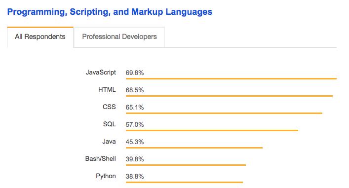
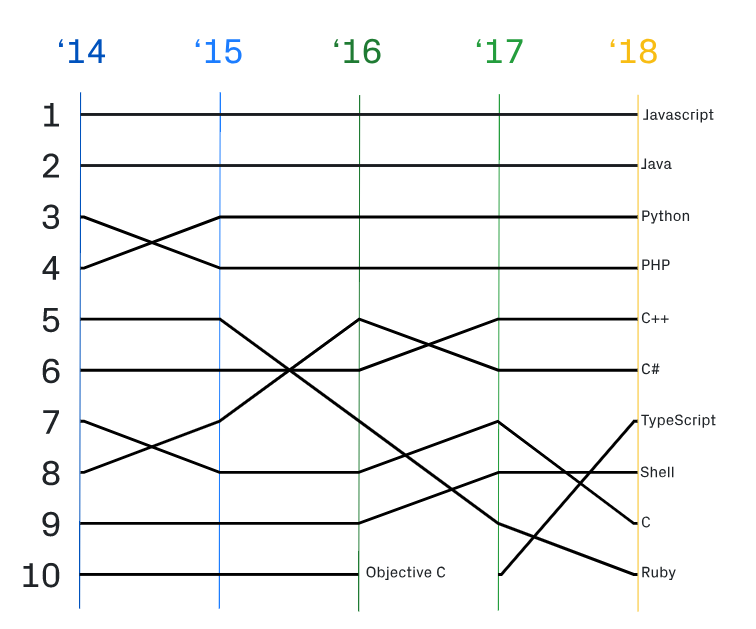
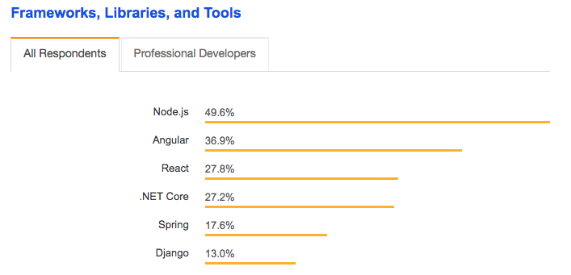
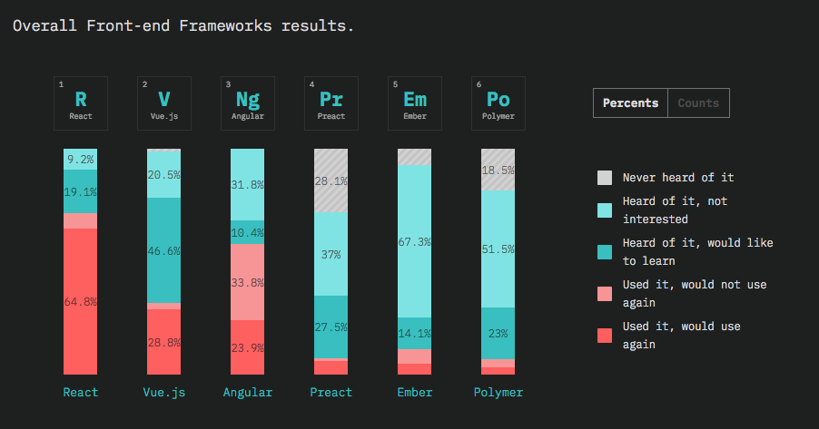
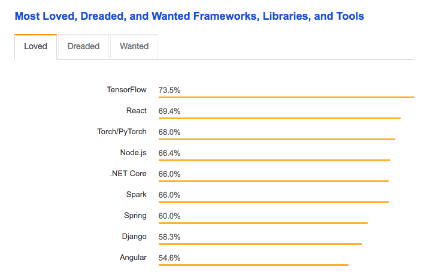
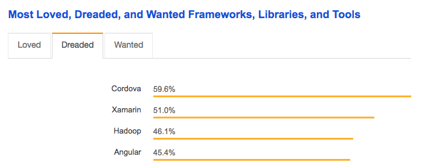
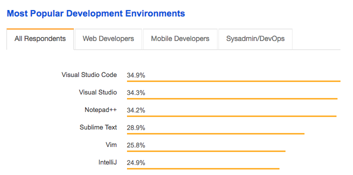

# zerrtech-boise-frontend-devs-2018

## Technology Trends

JavaScript is at the top of several lists of the most popular technologies.  No surprise there.  Owns the front end, big presence on the backend, too.

Stack Overflow 2018 Developer Survey, for programming languages, JS on top for the 6th straight year

Source: [Stack Overflow 2018 Developer Survey - Languages](https://insights.stackoverflow.com/survey/2018/#technology-programming-scripting-and-markup-languages)

Octoverse says roughly the same thing

Source: [Octoverse - Top Languages](https://octoverse.github.com/projects#languages)

Frameworks, Libraries, and Tools, Angular topping React

Source: [Stack Overflow 2018 Developer Survey - Frameworks](https://insights.stackoverflow.com/survey/2018/#technology-frameworks-libraries-and-tools)

State of JS approaches their survey in a little different way, React has a big edge on the "Used it, would use again"

Source: [State of JS 2018 - Front-end Frameworks](https://2018.stateofjs.com/front-end-frameworks/overview/)

State of JS 2018 Individual framework pages:
* [React](https://2018.stateofjs.com/front-end-frameworks/react/)
* [Vue.js](https://2018.stateofjs.com/front-end-frameworks/vuejs/)
* [Angular](https://2018.stateofjs.com/front-end-frameworks/angular/)

Most Loved Frameworks - React love

Most Dreaded Frameworks - Angular creeping up towards the top

Source: [Stack Overflow 2018 Developer Survey - Most Loved, Dreaded Frameworks](https://insights.stackoverflow.com/survey/2018/#technology-most-loved-dreaded-and-wanted-frameworks-libraries-and-tools)

VS Code somehow the most popular editor now

Source: [Stack Overflow 2018 Developer Survey - Most Popular Dev Environments](https://insights.stackoverflow.com/survey/2018/#technology-most-loved-dreaded-and-wanted-frameworks-libraries-and-tools)
